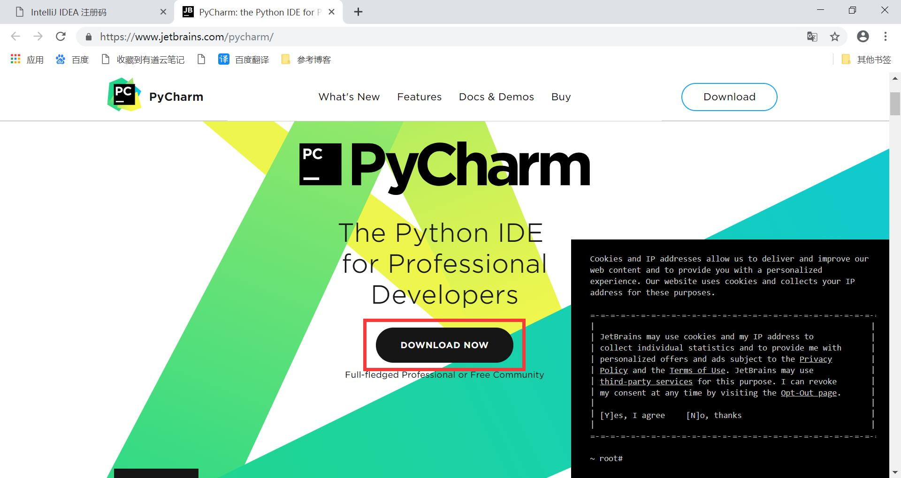
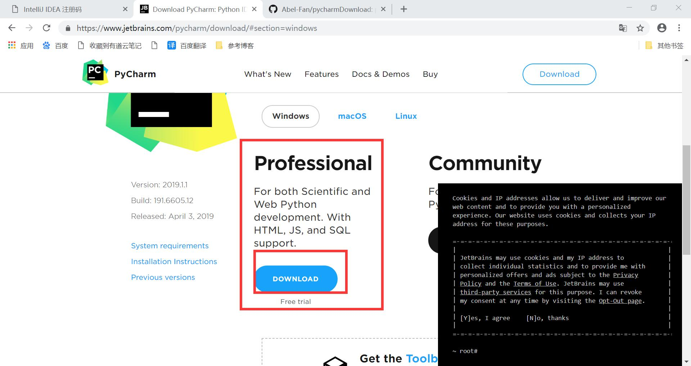
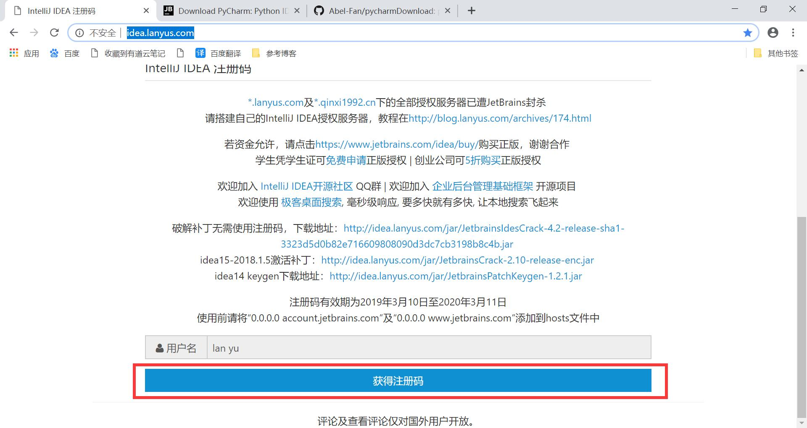

# pycharmDownload
pycharm下载与破解
>#### 一、下载pycharm
（1）打开pycharm[官网](https://www.jetbrains.com/pycharm/)
  

（2）点击下载选择专业版下载，专业版有更多功能。  

（3）接下来你可以按照安装软件的习惯进行安装。

>#### 二、破解pycharm
（1）下载完成之后打开pycharm
激活码获取位置
（2）打开蓝宇[官网](http://idea.lanyus.com/)
在蓝宇官网最底部获取最新激活码

（3）在pycharm输入激活码位置写入激活码